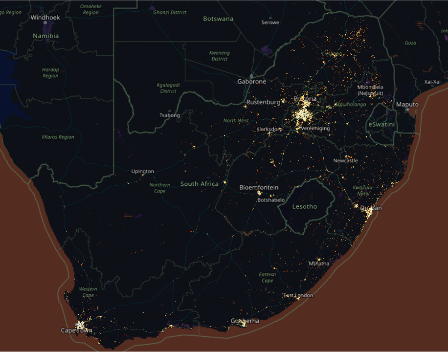

# Human Mobility Data Hub
This human mobility data repository is for the INFORM-Africa team members and collaborators. 
Data dictionaries and South Africa & Nigeria Datasets (human mobility metrics and public health) have been included. 
The knowledge transfer between the INFORM-Africa team and Villanova University Nova-Mobility Lab will improve the understanding of modeling personal trips data, geospatial analysis, and the influence of mobility on epidemiology & public health.  

## References
**If you find the data useful for your research, please cite our [paper](https://sajs.co.za/article/view/14727).**
```
@article{luoRevealingHumanMobility2023,
  title = {Revealing Human Mobility Trends during the {{SARS-CoV-2}} Pandemic in {{Nigeria}} via a Data-Driven Approach},
  author = {Luo, Weiyu and Xiong, Chenfeng and Wan, Jiajun and Feng, Ziteng and Ayorinde, Olawole and Blanco, Natalia and Charurat, Man and Naranbhai, Vivek and Riley, Christina and Winters, Anna and {Murtala-Ibrahim}, Fati and Abimiku, Alash'le},
  year = {2023},
  month = jun,
  journal = {South African Journal of Science},
  volume = {119},
  number = {5/6},
  issn = {1996-7489},
  doi = {10.17159/sajs.2023/14727},
  urldate = {2023-06-27},
  abstract = {We employed emerging smartphone-based location data and produced daily human mobility measurements using Nigeria as an application site. A data-driven analytical framework was developed for rigorously producing such measures using proven location intelligence and data-mining algorithms. Our study demonstrates the framework at the beginning of the SARS-CoV-2 pandemic and successfully quantifies human mobility patterns and trends in response to the unprecedented public health event. Another highlight of the paper is the assessment of the effectiveness of mobility-restricting policies as key lessons learned from the pandemic. We found that travel bans and federal lockdown policies failed to restrict trip-making behaviour, but had a significant impact on distance travelled. This paper contributes a first attempt to quantify daily human travel behaviour, such as trip-making behaviour and travelling distances, and how mobility-restricting policies took effect in sub-Saharan Africa during the pandemic. This study has the potential to enable a wide spectrum of quantitative studies on human mobility and health in sub-Saharan Africa using well-controlled, publicly available large data sets.},
  langid = {english},
}
```
## Human activity in South Africa
This is a density plot of 14 days (01 April 2020 to 14 April 2020) of human activity in South Africa. In the above 14 days, over 74,000,000 of sightings from about 903,000 devices were observed. Among the sightings, approx. 685,000 trips were identified.  

## Daily trip metrics of Nigeria
Trip metrics in the figure are calculated by aggregating the trip attributes at the Nigeria national level and cover the period 01 January to 25 April 2020, demonstrating the overall mobility changes in Nigeria at the beginning of the pandemic. Trips are identified by a calibrated recursive algorithm (Details can be found in the paper: https://sajs.co.za/article/view/14727). Trip attributes such as origin, destination, start time, end time, distance, etc., were recorded. 

## Daily trip metrics of Nigeria by wealth group
These figures are visualisation of the human mobility trends in percentage changes when compared with the January average. The statistics are reported for three different groups of states in Nigeria. The grouping was based on the groups’ relative wealth according to RWI percentile rankings. Two thresholds for RWI (i.e. 0.33 and 0.66) were selected to divide the states into three groups of equal sample sizes. More details can be found in the paper: https://sajs.co.za/article/view/14727  

Both trips and distances showed some level of increase shortly after the announcement of the first SARSCoV-2 case in Nigeria on 27 February 2020. 
### Daily # of trips/person
This figure is the trend of the seven-day moving average of daily trips/person in percentage change compared to January 2020 average. This metric is defined by daily identified # of trips divided by daily # of devices.  

The trends of daily # of trips/person showed discrepancies across state groups, especially after the announcement of the federal lockdown (30 March 2020). The daily trips per person of richer states rebounded drastically and stayed at the level of 110% compared with January 2020. For the relatively lower-income states, the daily number of trips decreased to around 83% of the January average.  
.png)
### Daily kilometers/person
This figure is the trend of the seven-day moving average of daily distance travelled (in kilometers) per person in percentage change compared to January 2020 average. This metric is defined by total travelled distance of daily identified trips divided by daily # of devices.  

The distance travelled per person in all state groups dropped in response to the government announcement (19 March 2020). Daily distances travelled in all groups continued to tumble, dropping to only 40–50% compared with the January average.  
.png)
